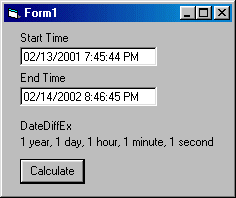

<div align="center">

## DateDiffEx


</div>

### Description

Input a Starting Time and an Ending Time and this function will translate it into English. For Example: DateDiffEx("02/12/2002 5:05:28 AM","02/14/2002 8:00:58 PM") Return= "2 days, 15 hours", DateDiffEx("02/14/2002 5:05:28 AM","02/14/2002 8:00:58 PM") Return= "15 hours, 55 minutes, 30 seconds". It only includes the "s" if the value does not equal 1. It eliminates the 0 values as well.
 
### More Info
 


<span>             |<span>
---                |---
**Submitted On**   |
**By**             |[Paul Mather](https://github.com/Planet-Source-Code/PSCIndex/blob/master/ByAuthor/paul-mather.md)
**Level**          |Beginner
**User Rating**    |4.6 (37 globes from 8 users)
**Compatibility**  |VB 5\.0, VB 6\.0
**Category**       |[Coding Standards](https://github.com/Planet-Source-Code/PSCIndex/blob/master/ByCategory/coding-standards__1-43.md)
**World**          |[Visual Basic](https://github.com/Planet-Source-Code/PSCIndex/blob/master/ByWorld/visual-basic.md)
**Archive File**   |[](https://github.com/Planet-Source-Code/paul-mather-datediffex__1-31810/archive/master.zip)


### Source Code

```
Public Function DateDiffEx(StartTime As Date, EndTime As Date) As String
 DateDiffEx = DateDiffExFormat(DateDiff("d", StartTime, EndTime) \ 365, "year")
 DateDiffEx = DateDiffEx & DateDiffExFormat((DateDiff("s", StartTime, EndTime) \ 86400) _
 Mod 365, "day")
 DateDiffEx = DateDiffEx & DateDiffExFormat((DateDiff("s", StartTime, EndTime) \ 3600) _
 Mod 24, "hour")
 DateDiffEx = DateDiffEx & DateDiffExFormat((DateDiff("s", StartTime, EndTime) \ 60) _
 Mod 60, "minute")
 DateDiffEx = DateDiffEx & DateDiffExFormat(DateDiff("s", StartTime, EndTime) _
 Mod 60, "second")
 If Len(DateDiffEx) > 0 Then
 DateDiffEx = Mid(DateDiffEx, 1, Len(DateDiffEx) - 2)
 End If
End Function
Private Function DateDiffExFormat(inputValue As Long, unitValue As String) As String
 If inputValue <> 0 Then
 DateDiffExFormat = inputValue & " " & unitValue & IIf(inputValue <> 1, "s", "") & ", "
 End If
End Function
```

